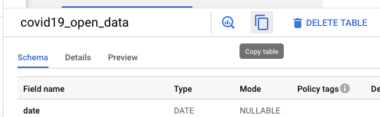
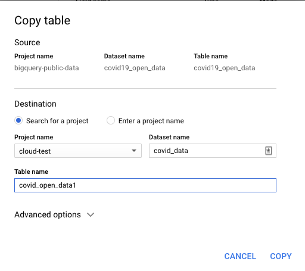

# COVID19-cloud

This gist will describe the process to:
1. Do a ETL process from GCP COVID public data into Azure BlobStorage
2. Execute SQL queries from Databricks
3. 

# ETL to Azure Blob Storage
The COVID 19 open data initially is located in Big Query. Although Big Query is not an storage query it is the only way access the data.
To make the data available from external services like Blob Storage the COVID table needs to be **copied to a project you own**. That will be the first step.

Open the `covid19_open_data` table and select `Copy Table`



Then select the project, dataset and table you want to copy it into


A Storage Account needs to be created on Azure. On the Storage Account set the account name and leave the other fields as default. Once the storage account is created and deployed, go into the storage account and on the "Containers" section create a new container with a name of your choosing.

Now on you azure account create a Data Factory, once created go into the Monitoring screen for that data factory and create a new Pipeline. 
On the pipeline activities add a Copy data activity. After naming the activity, the source dataset needs to be setup. Create a new soruce data set and select Google BigQuery. Once selected BigQuery as the source open/edit it.


# Connect to Databricks

To connect the Azure BlobStorage to Databricks you should already have a Databricks account. 

Databricks needs a cluster created. It can be created con the Clusters section and "Create Cluster" button. Then enter the cluster name and leave the other fields as default (The creation can take a couple of minutes).

When the creation is completed go to the "Workspace" and create a new Notebook. On the new Notebook there is dropdown on the top left, select the recently created cluster.

On the Notebook the setup with BlobStorage needs to be made:
1. The connection with the BlobStorage needs to be made associating it with the clusters file system. The needed to connect with BlobStorage is:

    `CONTAINER_ID` = This is the container selected for the container inside the Storage Account created previously

    `STORAGE_ACCOUNT_NAME` = This is the Storage Account selected previously

    `STORAGE_ACCOUNT_KEY` = On the Storage Account go to the "Access keys" section and select a key
    ```python
    dbutils.fs.mount(
      source = "wasbs://<CONTAINER_ID>@<STORAGE_ACCOUNT_NAME>.blob.core.windows.net",
      mount_point = "/mnt/covid", # This can be set to any route
      extra_configs = {"fs.azure.account.key.<STORAGE_ACCOUNT_NAME>.blob.core.windows.net":"<STORAGE_ACCOUNT_KEY>"})
    ```
2. Verify the cluster file system has been linked with the BlobStorage, the files on the Storage Account should be displayed when running `%fs ls /mnt/covid`
3. The file can be read with spark using
    ```py
    df = spark.read.parquet("/mnt/covid/<FILE_NAME>",header=True)
    ```
    The read method can change depending on the file that is read, in this case it will read `.parquet` files.
4. Creata 