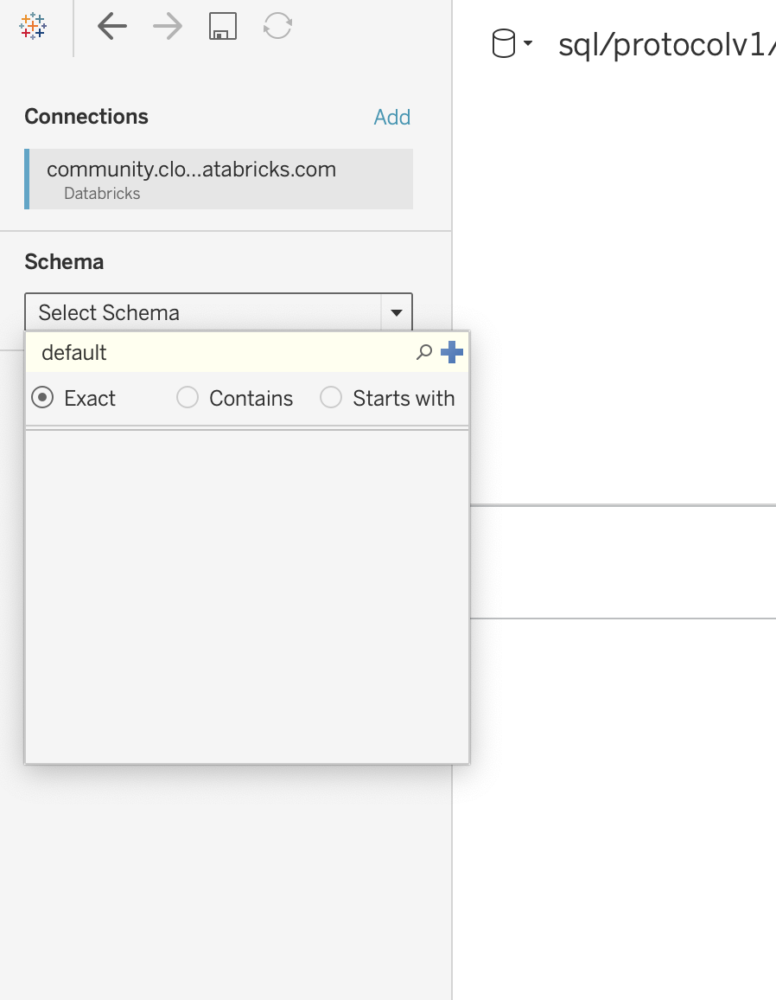

# COVID19-cloud
1. Do a ETL process from GCP COVID public data into Azure BlobStorage
2. Execute SQL queries from Databricks
3. Visualization

# ETL to Azure Blob Storage
The COVID 19 open data initially is located in Big Query. Although Big Query is not an storage query it is the only way access the data.
To make the data available from external services like Blob Storage the COVID table needs to be **copied to a project you own**. That will be the first step.

Open the `covid19_open_data` table and select `Copy Table`


Then select the project, dataset and table you want to copy it into


A Storage Account needs to be created on Azure. On the Storage Account set the account name and leave the other fields as default. Once the storage account is created and deployed, go into the storage account and on the "Containers" section create a new container with a name of your choosing.

Now on you azure account create a Data Factory, once created go into the Monitoring screen for that data factory and create a new Pipeline.

On the pipeline activities add a Copy data activity. After naming the activity, the source dataset needs to be setup. Create a new soruce data set and select Google BigQuery. Once selected BigQuery as the source open/edit it.

Here a new linked services needs to be created. We need to 


For the Client id and the Client secret we need to go to the credential section on inside API & Services. If there are no credentials created yet, go CREATE CREDENTIALS and select OAuth client ID.


Select Desktop App on the dropdown


Once the OAuth client is created you should have the Client id and the Client secret. 

We are missing the refresh token, go get is we need a couple more steps.

Go to this url, replacing <CLIENT_ID> with your Client id.

`https://accounts.google.com/o/oauth2/v2/auth?client_id=<CLIENT_ID>&redirect_uri=urn:ietf:wg:oauth:2.0:oob&state=GBQAUthTest&access_type=offline&scope=https://www.googleapis.com/auth/bigquery&response_type=code`

On that url you should login into your Google account and grant access 


Once the access is granted a Authorization code is generated. Note this code to be used in the next step.

Now go need to go do an HTTP POST request to https://www.googleapis.com/oauth2/v4/token using the previous data.


If the data is correct you will receive a response status 200 with the Refresh Token. Take note of the Refresh token.


Use the Refresh token on the linked service setup with the other attributes already collected. Try testing the connection before creating, if it fails the Refresh token could have expired.

You should be able to select the table and preview the data


Then on the sink tab select `New+`, then look for BlobStorage, and on the format type select "Parquet". 


Import shemas from the data structure


Select `Validate all` if no erros are displayed select `Publish all`.

One the publishing has completed trigger the execution


When the execution has completed a new file should have been created on the storage container.


# Connect to Databricks

To connect the Azure BlobStorage to Databricks you should already have a Databricks account. 

Databricks needs a cluster created. It can be created con the Clusters section and "Create Cluster" button. Then enter the cluster name and leave the other fields as default (The creation can take a couple of minutes).

When the creation is completed go to the "Workspace" and create a new Notebook. On the new Notebook there is dropdown on the top left, select the recently created cluster.

On the Notebook the setup with BlobStorage needs to be made:
1. The connection with the BlobStorage needs to be made associating it with the clusters file system. The needed to connect with BlobStorage is:

    `CONTAINER_ID` = This is the container selected for the container inside the Storage Account created previously

    `STORAGE_ACCOUNT_NAME` = This is the Storage Account selected previously

    `STORAGE_ACCOUNT_KEY` = On the Storage Account go to the "Access keys" section and select a key
    ```python
    dbutils.fs.mount(
      source = "wasbs://<CONTAINER_ID>@<STORAGE_ACCOUNT_NAME>.blob.core.windows.net",
      mount_point = "/mnt/covid", # This can be set to any route
      extra_configs = {"fs.azure.account.key.<STORAGE_ACCOUNT_NAME>.blob.core.windows.net":"<STORAGE_ACCOUNT_KEY>"})
    ```
2. Verify the cluster file system has been linked with the BlobStorage, the files on the Storage Account should be displayed when running `%fs ls /mnt/covid`
3. The file can be read with spark using
    ```py
    df = spark.read.parquet("/mnt/covid/<FILE_NAME>",header=True)
    ```
    The read method can change depending on the file that is read, in this case it will read `.parquet` files.
4. Create a delta table
    ```py
    archivo = "/mnt/covid/delta/covid/"
    df.write.format("delta").mode("overwrite").option("overwriteSchema","true").save(archivo)
    ```
    Make sure the table has been created

    


# Queries

1. Worldwide cases
    ```sql
    %sql
    SELECT count(1) as WORLDWIDE_CASES FROM covid
    ```


2. Which are the most affected countries
    ```sql
    %sql
    SELECT country_name as COUNTRY, count(1) as CASES 
    FROM covid
    GROUP BY country_name
    ORDER BY CASES DESC
    ```

3. Identify critical regions on the United States
    ```sql
    %sql
    SELECT subregion1_name as REGION, count(1) as CASES
    FROM covid
    WHERE country_code='US'
    GROUP BY subregion1_name
    ORDER BY cases DESC
    ```

4. Death Rate by country
    ```sql
    %sql
    SELECT country_name AS COUNTRY, 
    (SUM(new_deceased)/ IF(SUM(new_confirmed)=0,1,SUM(new_confirmed))) as DEATH_RATE
    FROM covid
    WHERE aggregation_level = 0
    GROUP BY country_name
    ORDER BY MORTALIDAD DESC
    ```

# Visualization
We are connecting DatBricks with Tableau to have visualizations on the queries.

The JDBC/ODBC driver is need aswell as Tableau Desktop. Install the driver from  <a href="https://docs.databricks.com/integrations/bi/jdbc-odbc-bi.html#driver">here</a>.


For this we need the connection details from Databricks to be entered on Tableau. These are displayed on the cluster and JDBC/ODBC section.


On Tableau on Connect to select the Databricks option and enter the connection details.


When the datasource has loaded go into the left-side panel and ***write*** the shema on which the data is loaded, this cases is ***default***.
 
Then **write** the table name, in my case is **covid**
 

Then drag the table into the center panel


On the worksheet you should now be able to see the data source with the loaded table. At this point any visualizations can be achieved.


